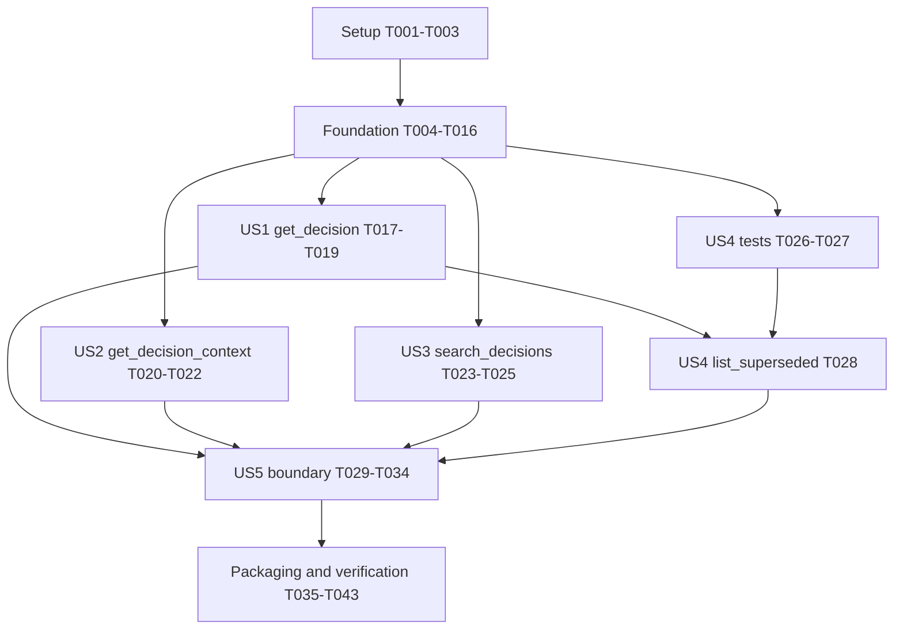

# Tasks: MCP Server (Read-Only Retrieval) — Phase 5

**Input**: Design documents from `specs/006-mcp-server/`

**Prerequisites**: `plan.md`, `spec.md`, `research.md`, `data-model.md`,
`contracts/core-projection.md`, `contracts/pagination-and-cursors.md`,
`contracts/tools.md`, `quickstart.md`, and `checklists/requirements.md`

**Normative**: `docs/adr/0001-record-architecture-decisions-in-git.md`,
`docs/adr/0002-typed-frontmatter-as-madr-superset.md`,
`docs/adr/0004-git-is-source-of-truth-database-is-an-index.md`,
`docs/adr/0007-adapter-isolation-and-public-surface-build.md`,
`docs/adr/0009-affects-resolution-and-catalog-binding.md`,
`docs/adr/0010-bun-toolchain.md`, `.specify/memory/constitution.md`, and the
maintainer's 2026-07-20 ratification of SC-016

> **Scope is closed.** Implement exactly four local stdio read-only tools:
> `search_decisions`, `get_decision`, `get_decision_context(files[])`, and
> `list_superseded`. Do not add a fifth tool, write/mutation capability, MCP
> prompts/resources/subscriptions/sampling, HTTP/SSE/auth, model/embedding/network
> access, persistent cache/index/database, named-log federation, multi-repository
> aggregation, or transitive supersession traversal.

**Tests**: REQUIRED and test-first. Every story's tests must be written and observed
failing before its implementation task begins. All fixtures are local, offline,
model-free, and credential-free.

**Toolchain**: Use stable Bun **1.3.14** for install, lockfile, build, lint, typecheck,
and tests. Published artifacts target Node **`>=22`** and must pass Node 22 and 24
smoke tests. Keep `bun.lock` text and the isolated linker in `bunfig.toml`.

## Format: `[ID] [P?] [Story?] Description with exact file path`

- **[P]**: Parallelizable only when the task uses different files and has no dependency
  on another incomplete task in the same phase.
- **[US1]…[US5]**: Used only in user-story phases and mapped directly to `spec.md`.
- Setup, foundational, and polish tasks intentionally omit story labels.

---

## Phase 1: Setup

**Purpose**: Create the first-party package and offline test substrate without adding
behavior outside the ratified boundary.

- [x] T001 Scaffold `@adrkit/mcp` in `packages/mcp/package.json`, `packages/mcp/tsconfig.json`, and `packages/mcp/tsconfig.build.json` with the current shared public-package version, repository/license/public-publish metadata and `files: ["dist", "README.md", "src"]` matching `@adrkit/evaluator`, only the sealed lifecycle factory/types at the package root plus the `adrkit-mcp` bin (no internal builder/test subpath), Node `>=22`, matching build/prepack/typecheck scripts, dependencies exactly `@adrkit/core: workspace:*`, `@modelcontextprotocol/sdk: 1.29.0`, and `zod: ^4`, dev dependency only `@types/bun`, then update `bun.lock` using stable Bun 1.3.14 without changing `bunfig.toml`
- [x] T002 [P] Create the documented offline fixture matrix and provenance notes in `packages/mcp/test/fixtures/README.md`, with one-record-per-status sources in `packages/mcp/test/fixtures/status-corpus/`, duplicate-id and supersession cases in `packages/mcp/test/fixtures/edge-corpus/`, schema-invalid and inert-matcher cases in `packages/mcp/test/fixtures/degraded-corpus/`, and no fetched or generated-at-test-time external content
- [x] T003 After T001 and T002, add reusable SDK client, temporary git-worktree fixture, complete-sandbox/parent-sentinel/`HOME`/`TMPDIR` snapshot, cursor-walk, and response-schema helpers in `packages/mcp/test/helpers.ts` using `InMemoryTransport.createLinkedPair()` and the pinned SDK client; also add compiling side-effect-free skeleton modules for every planned import in `packages/core/src/schema/ref.ts`, the one `packages/core/src/index.ts` export, `packages/mcp/src/corpus/{ordering,projection}.ts`, `packages/mcp/src/search/normalize.ts`, `packages/mcp/src/pagination/cursor.ts`, `packages/mcp/src/tools/{shared,get-decision,get-decision-context,search-decisions,list-superseded}.ts`, internal `packages/mcp/src/server.ts`, public `packages/mcp/src/index.ts`, `packages/mcp/src/main-module.ts`, and `packages/mcp/src/bin.ts`; each unimplemented callable throws exactly `Error("unimplemented")`, the package compiles, and no behavioral test may fail because a module or named export is absent

**Checkpoint**: The package installs under Bun 1.3.14 and tests can exercise registered
tool handlers entirely in process against disposable local corpora.

---

## Phase 2: Foundational Contracts

**Purpose**: Freeze and implement the shared parser, stable corpus projection, ordering,
normalization, findings, fingerprint, cursor, and response contracts that every story
depends on.

**Blocked by**: Phase 1. Test tasks T004–T010 must fail before their corresponding
implementation tasks T011–T016 begin.

### Foundational tests — write and observe failing first

- [x] T004 [P] After T003, write failing behavioral deep-equality tests for unqualified, leading-colon, and first-colon-qualified reference parsing in `packages/core/test/ref.test.ts` against the compiling `parseAdrRef` stub; record `packages/evaluator/test/no-orphan-refs.test.ts` green before and after T011 as a behavior-preservation regression guard that is not expected to fail first
- [x] T005 [P] Write failing locale-independent ordering and trim→NFKC→`toLowerCase()` normalization tests in `packages/mcp/test/ordering-normalize.test.ts`, including canonical `(id, sourcePath)`, finding-field, matched-field, Unicode-compatibility, case, and whitespace cases
- [x] T006 [P] After T003, write failing canonical-root tests in `packages/mcp/test/roots.test.ts` for ordinary `.git` directories, linked-worktree `.git` files, unreadable/non-git roots, absolute/`..`/string-prefix/symlink escapes, fresh root/dir validation before and after each load, candidate `lstat` rejection, candidate realpath containment, and deterministic root/directory swaps injected at every explicit validation checkpoint
- [x] T007 [P] After T003, write failing stable-load tests in `packages/mcp/test/projection.test.ts` for pre-read 64 KiB exclusion, `record-stat-error`/`record-too-large` error findings, zero-survivor handling without `lintCorpus({ paths: [] })`, schema-invalid exclusion, invariant-flagged record retention, equality plus zero and independently changed bigint `dev`/`ino`/`size`/`mtimeNs`, deterministic size/type/symlink/containment swaps, post-load rejection with no changed-path response data, fresh reloads, concurrent-call isolation, and the documented limitation that a transient swap reverting entirely between checkpoints is not claimed detectable
- [x] T008 [P] Write failing canonical-fingerprint tests in `packages/mcp/test/fingerprint.test.ts` for repeat equality, recursively sorted parsed projection bytes, YAML-only reserialization stability, body/source-path/finding/count sensitivity, and exclusion of tool-derived findings
- [x] T009 [P] Write failing cursor tests in `packages/mcp/test/cursor.test.ts` for fixed-field-order base64url V1 round trips, all eight tool/channel scopes, independent result/findings walks, query-shape hashes, primary-error precedence, and each reason `decode-failed`, `version-unsupported`, `wrong-channel`, `corpus-changed`, `query-mismatch`, `cursor-not-applicable`, and `offset-out-of-range`
- [x] T010 [P] After T003, write failing shared-contract tests in `packages/mcp/test/shared-contracts.test.ts` for strict bounded inputs, root-object output schemas, nested discriminated outcomes, schema-optional `corpusHealth` present on every branch except `corpus-unavailable`, no findings on non-substantive outcomes, paginated findings on every substantive outcome, exact `contracts/tools.md` §2.1 text/reason templates and the 512-UTF-16-unit bound, structured content, and fixed read-only annotations

### Foundational implementation

- [x] T011 [P] After T004, replace the `parseAdrRef` stub in `packages/core/src/schema/ref.ts` with behavior-preserving `ParsedAdrRef`/`parseAdrRef`, retain T003's single export in `packages/core/src/index.ts`, and replace only the private parser/import usage in `packages/evaluator/src/rules/no-orphan-refs.ts` without adding `formatAdrRef`, dependencies, or any other core/evaluator behavior; rerun the pre-recorded evaluator regression green
- [x] T012 [P] After T005, implement the sole code-unit comparator and canonical record/finding ordering helpers in `packages/mcp/src/corpus/ordering.ts`, never calling `localeCompare`
- [x] T013 [P] After T005, implement the sole search normalization helper in `packages/mcp/src/search/normalize.ts` as `trim()` → `normalize('NFKC')` → `toLowerCase()` with no locale, fuzzy, stemming, weight, embedding, or ranking path
- [x] T014 After T006–T008 and T012, replace the projection stub with `resolveCanonicalRoots` and fresh-per-call `loadCorpusProjection` in `packages/mcp/src/corpus/projection.ts`, revalidating root/`.git`/dir before and after the core load; `lstat`-rejecting non-regular/symlink candidates; realpath-checking segment-safe candidate containment; comparing bigint `dev`/`ino`/`size`/`mtimeNs`; using `discoverAdrFiles`, `lintCorpus` only for nonempty survivor lists, a local multi-valued bare-id index, immutable corpus findings, canonical parsed-projection SHA-256 fingerprinting, and no cache/database/log index; document that this detects observed checkpoint changes rather than claiming an atomic hostile-filesystem snapshot
- [x] T015 After T008–T009 and T012, implement strict cursor encoding, decoding, verification, query-shape hashing, range checking, and page slicing in `packages/mcp/src/pagination/cursor.ts`, preserving the exact verification order and independent channel semantics in `contracts/pagination-and-cursors.md`
- [x] T016 After T009–T010 and T012–T015, replace the shared stub with strict Zod limits, page/findings schemas, outcome envelopes, the sole exact text/reason renderer from `contracts/tools.md` §2.1 with a 512-UTF-16-unit cap, and fixed annotations in `packages/mcp/src/tools/shared.ts`, including query 256, ref 128, file 1024/256, tags 32×64, page 20/100, cursor 4 KiB, and source 64 KiB limits

**Checkpoint**: Shared core behavior is preserved, every call can build a stable immutable
projection, and every growing channel can be bounded and resumed deterministically.

---

## Phase 3: User Story 1 — Fetch One Authoritative Decision (Priority: P1) 🎯 MVP

**Goal**: Fetch a complete within-limit decision by ref, including graveyard records,
while making absent, duplicate-local-id, and log-qualified outcomes explicit.

**Independent Test**: Against the status fixture, retrieve all six statuses and verify full
typed frontmatter, complete body, repo-relative path, and unexpanded relations; separately
walk every duplicate-id candidate and verify not-found and federated-unavailable outcomes.

**Blocked by**: Phase 2.

### Tests for User Story 1 — write and observe failing first

- [x] T017 [P] [US1] After T016, write failing full-document and lookup-branch tests in `packages/mcp/test/get-decision.test.ts` for all six statuses, complete body/frontmatter, repo-relative paths, unexpanded four relation fields, not-found, oversized-source not-found plus finding, duplicate candidates, leading-colon behavior, qualified refs that never fall back to a same-id local record, and exact found/not-found/ambiguous/qualified-ref/corpus-unavailable text with singular/plural findings counts
- [x] T018 [P] [US1] After T016, write failing contract and pagination tests in `packages/mcp/test/get-decision-pagination.test.ts` for candidate/findings independence, canonical multi-page duplicate walks, all exact cursor text/reason failures including `cursor-not-applicable` on singleton outcomes, schema-valid structured content, the 512-UTF-16-unit content cap, no path or unbounded corpus interpolation, and bounded strict inputs

### Implementation for User Story 1

- [x] T019 [US1] After T017–T018, replace the `get_decision` stub with the registration and handler in `packages/mcp/src/tools/get-decision.ts`, using `parseAdrRef`, the fresh local `byId` bucket, verbatim `AdrFrontmatter`/body, corpus-only findings, the sole shared exact text renderer, and no relation expansion or log-aware lookup

**Checkpoint**: US1 is independently useful through its registered handler and is the
suggested MVP once the internal four-tool server and sealed stdio lifecycle are integrated
in US5.

---

## Phase 4: User Story 2 — Retrieve Decision Context for Files (Priority: P1)

**Goal**: Report governing, active-proposal, and historical records for logical file paths
using the existing resolver unchanged and without reading caller-supplied paths.

**Independent Test**: Supply logical paths matching one record in each status bucket and
verify all six statuses appear in exactly one collection with fired matchers, relations,
and honest inert findings.

**Blocked by**: Phase 2. It has no behavioral dependency on US1.

### Tests for User Story 2 — write and observe failing first

- [x] T020 [P] [US2] After T016, write failing context-resolution tests in `packages/mcp/test/get-decision-context.test.ts` for per-record `resolveAffects`, all six statuses partitioned exactly once, multi-bucket matches, zero matches, fired matchers, unexpanded `supersedes`/`supersededBy`/`relatesTo`/`conflictsWith`, repo-qualified matcher inactivity, missing backing sources as informational inert findings, and exact all-found/ambiguous/partial/not-found/corpus-unavailable text with singular/plural request and findings counts
- [x] T021 [P] [US2] After T016, write failing validation, findings, and pagination tests in `packages/mcp/test/get-decision-context-pagination.test.ts` for absolute/drive/`..`/backslash/empty path rejection before handler access, canonical de-duplicated `files[]` query binding, one flat result walk partitioned after slicing, independently paged derived findings, unchanged corpus fingerprint across input-specific findings, no caller-path filesystem reads, every exact cursor text/reason branch, the 512-UTF-16-unit content cap, and no path or unbounded corpus interpolation

### Implementation for User Story 2

- [x] T022 [US2] After T020–T021, replace the `get_decision_context` stub with the registration and handler in `packages/mcp/src/tools/get-decision-context.ts`, calling `resolveAffects({ records: [record], changedFiles: files })` once per record, composing findings without mutating the projection, paginating the canonical union before status partitioning, and using the sole shared exact text renderer

**Checkpoint**: US2 independently answers pre-change governance questions with no second
affects resolver and no arbitrary file read.

---

## Phase 5: User Story 3 — Search the Corpus and Graveyard (Priority: P1)

**Goal**: Search id, title, tags, and Markdown body by deterministic normalized literal
substring, including graveyard records by default and returning bounded summaries only.

**Independent Test**: Search for body-only and rejected-title terms, verify matched-field
indicators and filter algebra, then repeat a complete paginated walk byte-for-byte.

**Blocked by**: Phase 2. It has no behavioral dependency on US1 or US2.

### Tests for User Story 3 — write and observe failing first

- [x] T023 [P] [US3] After T016, write failing search behavior tests in `packages/mcp/test/search-decisions.test.ts` for id/title/tag/body matching, whitespace/mixed-case/NFKC normalization, whitespace-only rejection before corpus access, graveyard-by-default behavior, empty results, bounded summaries without body, every matched-field indicator, status/scope any-of, tags all-of, category AND composition, uniqueness, all fixed boundaries, and exact results/corpus-unavailable text with zero/one/many result and findings counts
- [x] T024 [P] [US3] After T016, write failing search determinism tests in `packages/mcp/test/search-decisions-pagination.test.ts` for canonical non-relevance order, byte-identical repeated calls, lossless multi-page result/findings walks, result/findings cursor independence, query/filter/limit mismatch rejection, stale-corpus rejection, schema-invalid-record degradation without suppressing valid matches, every exact cursor text/reason branch, the 512-UTF-16-unit content cap, and no path or unbounded corpus interpolation

### Implementation for User Story 3

- [x] T025 [US3] After T023–T024, replace the `search_decisions` stub with the registration and handler in `packages/mcp/src/tools/search-decisions.ts`, applying filters before the shared normalizer, reporting all matching fields in canonical order, returning summaries only, deriving no findings beyond corpus findings, and using the sole shared exact text renderer

**Checkpoint**: US3 independently answers “has this been decided or tried?” without a
model, ranking heuristic, or hidden index.

---

## Phase 6: User Story 4 — List Direct Supersession History (Priority: P2)

**Goal**: List every superseded record with its direct local replacement state, preserving
dangling, ambiguous, and federated-unavailable targets without guessing.

**Independent Test**: Walk a corpus with resolved, dangling, duplicate-id, and qualified
targets; verify every superseded source appears once, target status is current, ambiguity is
count-only, and a follow-up `get_decision` returns the full candidates.

**Blocked by**: Phase 2. The follow-up integration assertion uses US1 T019.

### Tests for User Story 4 — write and observe failing first

- [x] T026 [P] [US4] After T016, write failing direct-edge tests in `packages/mcp/test/list-superseded.test.ts` for complete/empty listings, current target status, direct edges only, dangling targets retaining the core finding, qualified targets retaining both core and informational derived findings, no silently selected local substitute, and exact result/corpus-unavailable text with zero/one/many entry and findings counts
- [x] T027 [P] [US4] After T016, write failing ambiguity and pagination tests in `packages/mcp/test/list-superseded-pagination.test.ts` for canonical lossless pages, `candidateCount` without nested candidates, one fixed warn finding per ambiguous entry, independently paged findings, a follow-up paginated `get_decision` candidate walk, every exact cursor text/reason branch, the 512-UTF-16-unit content cap, and no path or unbounded corpus interpolation

### Implementation for User Story 4

- [x] T028 [US4] After T019 and T026–T027, replace the `list_superseded` stub with the registration and handler in `packages/mcp/src/tools/list-superseded.ts`, resolving only direct unqualified local targets through `byId`, minting only the two specified derived finding templates, never walking lineage or embedding candidate arrays, and using the sole shared exact text renderer

**Checkpoint**: US4 independently exposes the graveyard's direct replacement map without
federation or unbounded nested results.

---

## Phase 7: User Story 5 — Prove the Harness Boundary (Priority: P2)

**Goal**: Expose only the four ratified tools over local stdio and prove strict validation,
a sealed lifecycle-only public handle, bounded side-effect denial, no arbitrary reads,
no non-protocol stdout, and no cross-call mutable state.

**Independent Test**: Run all four tools through the package-internal in-memory builder
and the public stdio lifecycle under adversarial filesystem/input/side-effect traps;
verify only four tool registrations, a frozen null-prototype public handle, protocol-only
stdout, unchanged snapshots, and deterministic completion offline.

**Blocked by**: T019, T022, T025, and T028.

### Tests for User Story 5 — write and observe failing first

- [x] T029 [P] [US5] After T019, T022, T025, and T028, write failing public-surface tests in `packages/mcp/test/surface.test.ts` asserting `createAdrkitMcpServer` has no import-time or construction-time I/O and returns a frozen null-prototype object with exactly own `start`/`close`, no own symbols, no caller transport, and no SDK server/registration/internal builder; through the package-internal builder assert `tools/list` exposes exactly the four named tools with root-object output schemas and fixed annotations and no prompt/resource/subscription/sampling capability
- [x] T030 [P] [US5] After T003, T019, T022, T025, and T028, write failing boundary tests in `packages/mcp/test/boundary.test.ts` that trap reads/stats outside canonical roots, take complete byte/mode/path snapshots of the disposable sandbox, parent sentinels, `HOME`, and `TMPDIR` before and after every tool, reject unknown/wrong/oversized/traversal inputs before corpus access, scan every successful response for absolute paths, prove fresh rereads after corpus edits, and prove concurrent calls do not share mutable findings/results
- [x] T031 [P] [US5] After T019, T022, T025, and T028, write failing CLI and real-stdio tests in `packages/mcp/test/bin.test.ts` for flag-over-env-over-default precedence, unknown/missing-value exit 2, invalid root/dir exit 1 with stderr-only diagnostics, linked worktree support, Bun-source subprocess initialize/list/call/shutdown, and line-by-line zero non-JSON-RPC stdout bytes
- [x] T032 [P] [US5] After T003, write the failing runtime/import boundary test and preload in `packages/mcp/test/side-effect-denial.test.ts` and `packages/mcp/test/side-effect-denial-preload.mjs`; via `createRequire` plus `syncBuiltinESMExports`, fail closed on every exact Node/Bun filesystem-mutation, write-capable open/FileHandle, child-process, cluster, worker, `process.dlopen`, network/listen, and Bun spawn/write/delete/writer API enumerated in `contracts/tools.md` §10.1 and `research.md` §R10; statically reject Bun shell escape paths that cannot be patched reliably plus HTTP/OAuth SDK subpaths, models, embeddings, native addons, worker helpers, and subprocess imports; exercise startup and every outcome branch of all four tools; prove preload coverage for static/dynamic imports, aliases/references, write-flag decoding, and returned FileHandles; and state that passing is bounded executed-path evidence, not proof against raw native syscalls or future unenumerated APIs

### Implementation for User Story 5

- [x] T033 [US5] After T029–T032, replace the internal server and public factory stubs: `packages/mcp/src/server.ts` keeps `McpServer`, registration APIs, and the in-memory test builder package-internal while registering exactly T019/T022/T025/T028; `packages/mcp/src/index.ts` exports only the lifecycle types/factory and returns a frozen null-prototype handle with exactly `start(): Promise<void>` and `close(): Promise<void>`, no symbols, no SDK object, and no caller-supplied transport, while holding only immutable startup configuration
- [x] T034 [US5] After T031 and T033, replace the `isMainModule`/`main(argv, env)`/bin stubs in `packages/mcp/src/main-module.ts` and `packages/mcp/src/bin.ts`, parsing only `--cwd`/`--dir` plus `ADRKIT_MCP_CWD`/`ADRKIT_MCP_DIR`, failing fast through shared canonical-root checks, constructing and connecting `StdioServerTransport` only inside lifecycle start, reserving stdout for protocol frames, closing cleanly on signals, setting nonzero status on unhandled rejection, and satisfying the side-effect-denial tests without fallback transports or logging

**Checkpoint**: The complete public server is safe to grant to a local harness and all five
stories are independently verifiable through the real registered surface.

---

## Phase 8: Packaging, Documentation, and Cross-Cutting Verification

**Purpose**: Enforce dependency, distribution, runtime, and release-policy guarantees and
validate the complete feature in clean-clone and installed-tarball forms.

**Blocked by**: All selected user stories.

- [x] T035 [P] Add failing `@adrkit/mcp` allow-list and rejection cases to `scripts/check-deps.test.ts` for exactly `@adrkit/core`, `@modelcontextprotocol/sdk`, and `zod` production dependencies plus `@types/bun` development-only, rejecting adapters, undeclared SDK subpaths/packages, GitHub toolkits, network/auth/model/embedding/database/cache libraries, native addons, and worker helpers
- [x] T036 After T001 and T035, extend `allowedDependenciesFor` in `scripts/check-deps.ts` for `@adrkit/mcp`, then verify the direct declaration boundary against `packages/mcp/package.json` and `bun.lock` without claiming that this static check replaces T032's executed-path evidence or proves the SDK transitive closure has no network-capable code
- [x] T037 [P] Add failing fourth-public-package, aligned-version, sealed-public-export, no-internal-test-export, packed-bin, expected-files, workspace-protocol-rewrite, dependency-order, and installed-tarball assertions for `@adrkit/mcp` in `scripts/release-pack.test.ts`, preserving the policy that every public package manifest has one identical stable SemVer
- [x] T038 After T029–T034, T037, and all story implementations, add `@adrkit/mcp` after the existing public packages in `RELEASE_PACKAGES`, validate `adrkit-mcp -> ./dist/bin.js`, and extend the generated installed-tarball smoke in `scripts/release-pack.ts` to import and structurally verify the sealed public handle then spawn the packed bin and call all four tools over stdio, leaving `scripts/release-publish.ts` unchanged and requiring `packages/core/package.json`, `packages/evaluator/package.json`, `packages/cli/package.json`, and `packages/mcp/package.json` to remain version-aligned for the eventual coordinated release
- [x] T039 After T034 and T038, extend the built-artifact Node 22/24 smoke in `scripts/smoke-node.mjs` to import `packages/mcp/dist/index.js`, verify the sealed handle, run `packages/mcp/dist/bin.js` against the real `docs/adr/` corpus under the side-effect-denial preload, exercise all four tools, and reject any non-protocol stdout or Bun-only published-runtime dependency
- [x] T040 [P] Document factory and `adrkit-mcp --cwd/--dir` use, four-tool contracts, limits, graveyard defaults, cursor restart rules, stderr/stdout behavior, and all exclusions in `packages/mcp/README.md` and `README.md`; update the four-public-package distribution row, dependency/chronological publish order, and coordinated-version release step in `docs/RELEASING.md` without choosing a future release number
- [x] T041 After T036 and T038–T040, run the clean-checkout flow from `docs/RELEASING.md` with stable Bun 1.3.14: permit only `bun install --frozen-lockfile` to contact the unauthenticated public registry using committed `bun.lock` and `bunfig.toml`, then disable networking and run build/typecheck/test/lint/release-pack plus the packed install and `.release/smoke/smoke.mjs` under Node 22 and 24 with no credentials/services; confirm all four public package versions, packed workspace dependency rewrites, sealed factory import, bin executable, and four tool calls without requiring a warm global package cache
- [x] T042 After T041, with networking still disabled run the complete post-install repository gates from `package.json` and `.github/workflows/ci.yml`: typecheck, build, release pack, lint, all Bun tests, schema emit with byte-clean `schema/adr.schema.json`, unchanged `packages/ci/dist`, dependency checks, ADR lint, and Node 22/24 built plus installed-tarball smoke; actual npm publication, tag creation, version choice, and `scripts/release-publish.ts` changes remain out of scope
- [x] T043 After T042, audit the final diff against `specs/006-mcp-server/contracts/core-projection.md` and `specs/006-mcp-server/contracts/tools.md`: outside `packages/mcp/`, release/docs wiring, `packages/core/src/schema/ref.ts`, the one `packages/core/src/index.ts` export, and the parser-only `packages/evaluator/src/rules/no-orphan-refs.ts` migration, reject any extra production surface or schema change and rerun the sealed-handle, side-effect-denial, complete-snapshot, and protocol-only evidence

---

## Dependencies & Execution Order

### Phase Dependencies

- **Setup (T001–T003)**: Starts immediately. T002 may run beside T001; T003 follows both.
- **Foundation (T004–T016)**: Depends on Setup. Tests T004–T010 run first and may run in
  parallel. T011–T016 then follow their named tests and dependencies.
- **US1 (T017–T019)**: Depends on Foundation and is the MVP behavior.
- **US2 (T020–T022)**: Depends on Foundation; no behavioral dependency on US1.
- **US3 (T023–T025)**: Depends on Foundation; no behavioral dependency on US1/US2.
- **US4 (T026–T028)**: Depends on Foundation; T028 additionally depends on US1 T019 for
  the specified follow-up candidate integration.
- **US5 (T029–T034)**: Integrates the package-internal four-tool server and sealed public
  stdio lifecycle after all four tool handlers exist; T033 waits for T029–T032 and T034
  waits for T031 plus T033.
- **Packaging/verification (T035–T043)**: Final release wiring and full gates follow the
  complete selected story set.

### User Story Completion Graph



### Concrete Critical Path

```text
T001 + T002 -> T003
  -> T004-T010
  -> T011-T016
  -> T017-T019 (MVP behavior)
  -> T026-T028
  +  T020-T022
  +  T023-T025
  -> T029-T034
  -> T035-T043
```

Each behavioral test task must be observed failing through T003's
`Error("unimplemented")` stub or the intended behavior/contract assertion before its paired
implementation begins. Missing modules/exports, fixture typos, unresolved dependencies, and
unrelated compile errors never satisfy the test-first gate. T004's existing evaluator suite
is a green regression guard recorded before and after T011, not a deliberately red test.

---

## Success-Criteria Traceability

| Success criterion | Primary proving tasks |
|---|---|
| SC-001 full decision/all statuses/size guard | T007, T017–T019 |
| SC-002 graveyard and body search | T023–T025 |
| SC-003 duplicate-id walk and qualified ref | T017–T019 |
| SC-004 six-status context partition | T020–T022 |
| SC-005 filesystem/write/path boundary | T006–T007, T030, T032–T034, T043 |
| SC-006 protocol-only stdout | T031, T034, T039 |
| SC-007 structured plus text responses | T010, T017–T028 |
| SC-008 lossless result/findings pagination | T009, T018, T021, T024, T027 |
| SC-009 invalid record degrades | T007, T024 |
| SC-010 absent backing is inert | T020–T022 |
| SC-011 direct supersession outcomes | T026–T028 |
| SC-012 frozen public install, then offline gates | T041–T042 |
| SC-013 dependency/import/runtime side-effect boundary | T032, T035–T036, T039, T043 |
| SC-014 byte-identical search | T008–T009, T024–T025 |
| SC-015 relation refs followed explicitly | T017–T019, T020–T022 |
| SC-016 maintainer ratification | Satisfied 2026-07-20 before this task list |

---

## Parallel Execution Examples

### User Story 1

```text
After Foundation: T017 || T018
Then: T019
```

### User Story 2

```text
After Foundation: T020 || T021
Then: T022
```

### User Story 3

```text
After Foundation: T023 || T024
Then: T025
```

### User Story 4

```text
After Foundation: T026 || T027
Then, after T019: T028
```

### User Story 5

```text
After T019 + T022 + T025 + T028: T029 || T030 || T031 || T032
Then: T033 -> T034
```

Cross-story tool tests and implementations for US1–US3, plus US4 tests, may proceed in
parallel after Foundation because they use distinct tool and test files. US5 is the
intentional integration barrier that exposes exactly four tools through one package-internal
builder and only a sealed stdio lifecycle through the public factory.

---

## Implementation Strategy

### MVP First

1. Complete Setup and Foundation.
2. Write T017–T018 and observe the intended failures.
3. Implement US1 T019.
4. Stop and validate US1 independently against all six statuses, duplicate ids, qualified
   refs, complete bodies, oversized exclusions, findings, and cursor behavior.
5. The deployable MCP MVP additionally requires US5's final package-internal four-tool
   server/sealed-stdio lifecycle boundary; do not publish a temporary one-tool package.

### Incremental Delivery

1. **US1**: Authoritative full-document lookup by ref.
2. **US2**: File-oriented governing/proposal/history context.
3. **US3**: Deterministic corpus and graveyard search.
4. **US4**: Direct supersession orientation.
5. **US5**: Exact internal four-tool server, sealed public stdio lifecycle, bin, and bounded
   side-effect/offline boundary.
6. Add dependency/release wiring, documentation, clean-clone, tarball, and Node 22/24 proof.

### Non-Negotiable Boundaries

- Exactly four tools; no fifth tool or other MCP capability.
- The public root exports only a frozen null-prototype `{ start, close }` lifecycle handle;
  SDK servers, registration methods, internal builders, and transports are not exported.
- Read-only local stdio only; no HTTP/SSE/auth, write/proposal, model, embedding, network,
  persistent cache/index/database, named-log federation, or multi-repository aggregation.
- Every tool call reloads the corpus; only configured root/dir strings plus the expected
  startup canonical root are retained, and root/`.git`/dir/candidates are revalidated
  around every load.
- `@adrkit/core` changes only by `parseAdrRef` plus one export; evaluator changes only by
  migrating its private parser.
- Stable Bun 1.3.14 is the development gate; published tarballs run on Node `>=22`.
- A frozen install may contact only the unauthenticated public registry; every later gate and
  runtime path runs with networking disabled and without credentials or services.
- All public npm package versions remain identical. The actual next release number is a
  maintainer scheduling choice made at release time; publication, tags, and
  `scripts/release-publish.ts` changes are not Phase 5 implementation tasks.

---

## Task Totals

- **Total tasks**: 43
- **Setup**: 3
- **Foundational**: 13
- **US1**: 3
- **US2**: 3
- **US3**: 3
- **US4**: 3
- **US5**: 6
- **Packaging/documentation/verification**: 9
- **Explicit `[P]` opportunities**: 26
